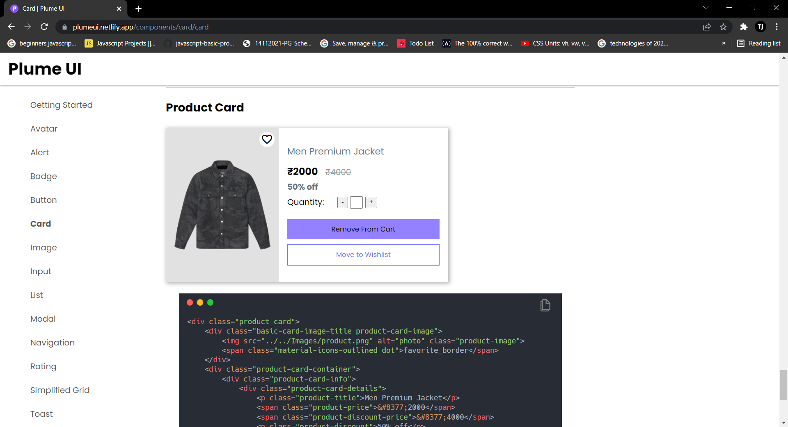

# [**Plume UI**](https://plumeui.netlify.app/)

A CSS component library to speed 🚀 up your development process of building elegant and responsive web apps.

## Technologies Used

1. HTML
2. CSS
3. JAVASCRIPT

## Components Included

- Avatar
- Alert
- Badge
- Button
- Card
- Image
- Input
- List
- Modal
- Navigation
- Rating
- Simplified Grid
- Toast
- Text Utilities

## Demo




## Installation

In order to use this library in your project just Copy the Link given below and paste it in the **<head>** tag of your html, above all other stylesheets.

```html
<link rel="stylesheet" href="<https://plumeui.netlify.app/Styles/main.css>" />
```

### Documentation

Check out Documentation on [Plume UI](https://plumeui.netlify.app/components/usage/usage) .

## Author

- LinkedIn - [Tajinder Singh](https://www.linkedin.com/in/tajinder-singh-2a0618221/)
